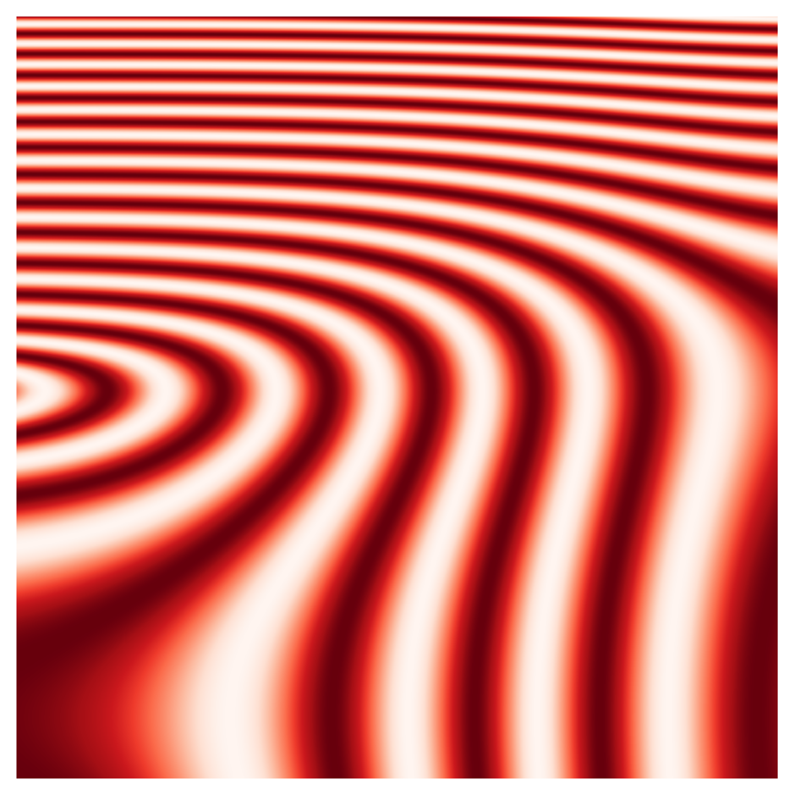

# Bold Gradation

### Bold designs produced by subtle colour variation.

Created by Sadie Bartholomew, May 2022 +

### Final designs

#### Top-level designs

##### Forth:

##### Vicinity:

##### Union:

#### Tubular Forms

A distinct sub-project in the form of a coherent set of five designs.

|            |    |
:-------------------------:|:-------------------------:
Change of Motion:   |  Direct Approach: 
Sharp Left:   |  Object in the Foreground: <
Sun to Plain:   |
