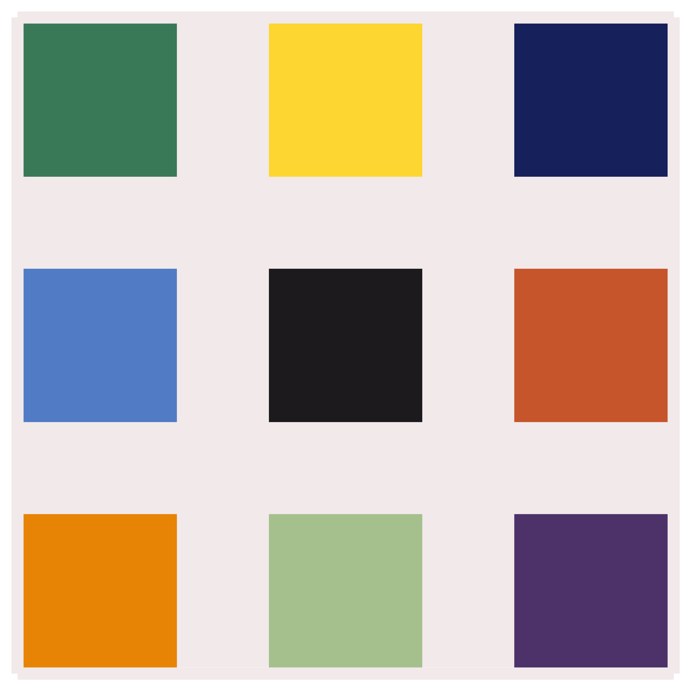

# Ellsworth Kelly Replications

### Replication of, and variations on, selected artworks by Ellsworth Kelly

#### Created by Sadie Bartholomew, 2019

## Design Gallery

Ellsworth Kelly (1923-2015)
[was an American artist](https://ellsworthkelly.org/biography/).

This mini-project uses NumPy arrays to reproduce some of his works, notably
after demonstrating the general procedure & code for representation with some
(visually) trivial works (*Nine Squares* & *Spectrum I*), focuses on his
works based on arbitrary ("by chance") arrangement of coloured squares to
form gridded compositions (*Colors for a Large Wall* & some works from the
*Spectrum Colors Arranged by Chance* series).

In the latter case, four generated replications are shown in a grid to
demonstrate the variance in designs created using random sampling. Every
run of the code gives a different variation that adheres to the
general pattern & structure by the configuration parameters applied.

|                                                                                                                                                                   |                                                                                                                                                                    |
| :---------------------------------------------------------------------------------------------------------------------------------------------------------------: | :----------------------------------------------------------------------------------------------------------------------------------------------------------------: |
|                  [Nine Squares](https://www.tate.org.uk/art/artworks/kelly-nine-squares-p77435):                   |                             [Spectrum I](https://ellsworthkelly.org/work/spectrum-i/):                              |
|              [Colors for a Large Wall](https://ellsworthkelly.org/work/colors-for-a-large-wall/):               |             [Spectrum Colors Arranged by Chance II](https://www.moma.org/collection/works/37202):               |
| [Spectrum Colors Arranged by Chance IV](https://ellsworthkelly.org/work/spectrum-colors-arranged-by-chance/):  | [Spectrum Colors Arranged by Chance VII](https://ellsworthkelly.org/work/spectrum-colors-arranged-by-chance/):  |
|                                 [Cité](https://ellsworthkelly.org/work/cite/):                                   |

