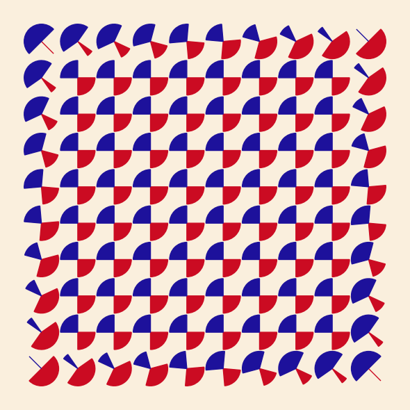

# Julio Le Parc Replications

### Replication of selected artworks by Julio Le Parc

#### Created by Sadie Bartholomew, 2020+

Julio Le Parc (1928+)
[is an Argentinian artist](http://www.julioleparc.org/bio.html).

This mini-project is under development, but interim outputs will be shown
below.

## Interim Outputs

#### Mutation of Forms

Reconstruction of Le Parc's Mutation of Forms (1959), described for example
on the
[site of the The Metropolitan Museum of Art](https://www.metmuseum.org/art/collction/search/815337).

*Note*: this is unfinished, namely the inner pairs of wedges need adjusting
for angular extent and alignment, though the outermost wedge pairs are
correct in that respect.

