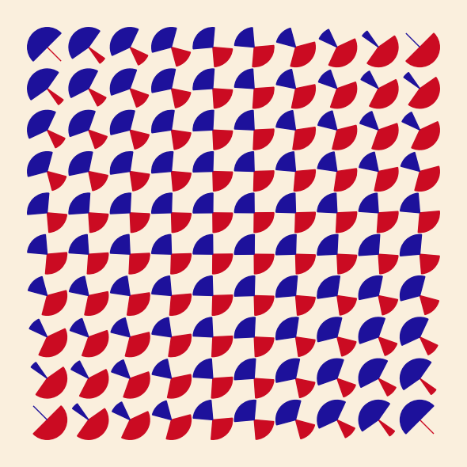

# Julio Le Parc Replications

### Replication of selected artworks by Julio Le Parc

#### Created by Sadie Bartholomew, 2020+

Julio Le Parc (1928+)
[is an Argentinian artist](http://www.julioleparc.org/bio.html).

This mini-project is under development, so further replications will be
incrementally coded up and added to the gallery below.

## Outputs Gallery

### Mutation of Forms

#### Replication of original

Reconstruction of Le Parc's Mutation of Forms (1959), described for example
on the
[site of the The Metropolitan Museum of Art](https://www.metmuseum.org/art/collection/search/815337).

