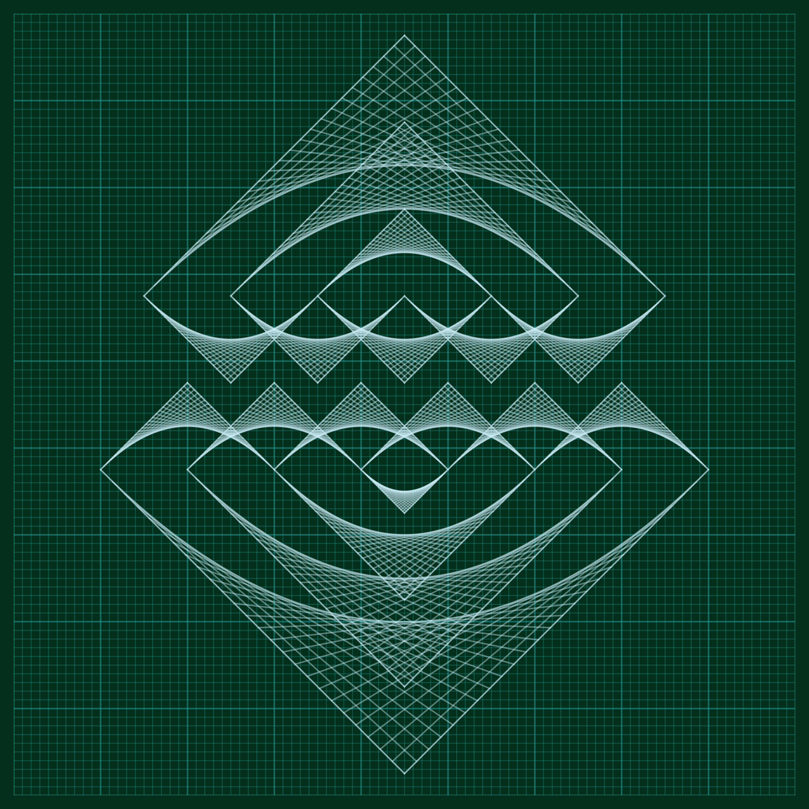
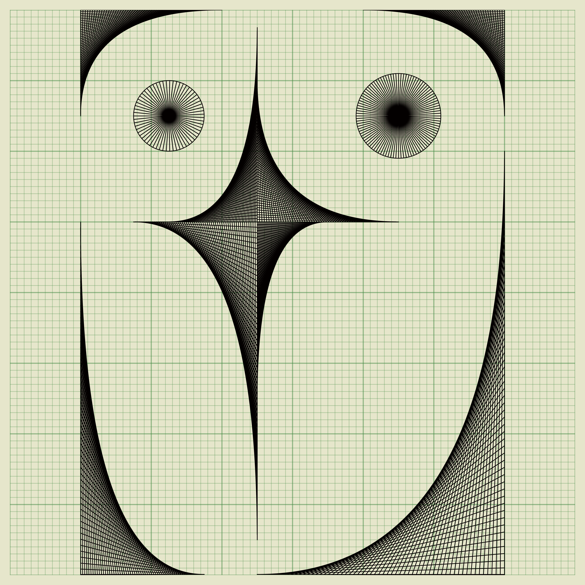

# Lenore Tawney Replications and Variations

### Replication of, and variations on, linear drawings by Lenore Tawney

#### Created by Sadie Bartholomew, 2021+

Lenore Tawney (1907-2007)
[was an American artist](https://lenoretawney.org/lenore-tawney/).

The variations aspect of this mini-project is under development, so
further variations will be incrementally coded up and added to the
gallery below.

## Outputs Gallery

### Replications of the original drawings

#### From Its Center

#### The Great Breath

#### Wings of the Wind

#### Union of Water and Fire II

#### The Eternal Band

#### Blue Circle

### My own variations using the same (digitised) technique

These nine designs are all my original work and form a collection I call **Emergent Curves**.

#### Treble Clef

#### Softening

#### Crosses on our Eyes

#### Jaws of Resonance

#### Owl

#### Always the Hourglass

#### Angry Eyes and Mouth of a God

#### Primitive Surveillance

#### Phototaxis

