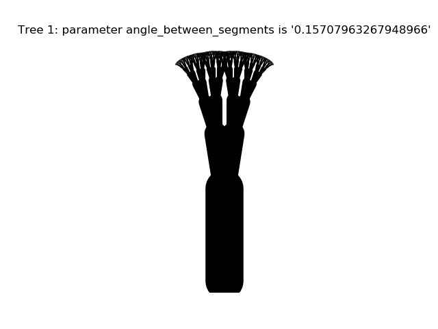
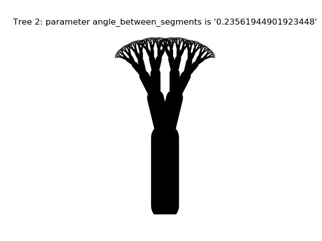
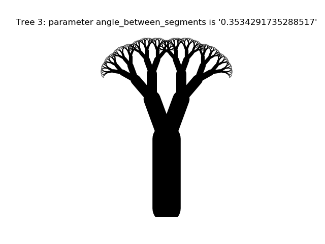
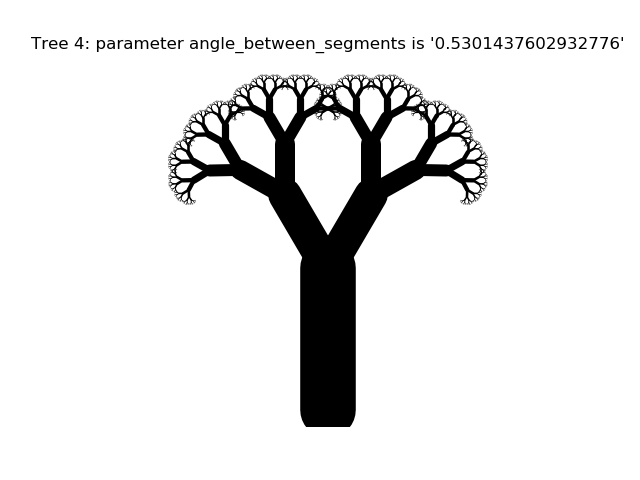
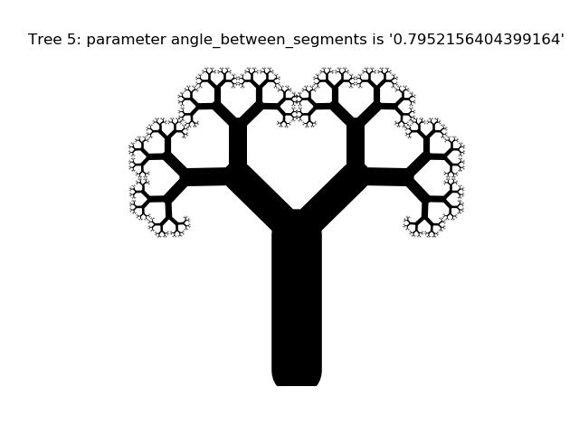

# Tree Profiles

### Attempts to recreate the side profile of a range of common trees in their bare (leafless) form.

#### Created by Sadie Bartholomew, 2020+

This mini-project is under (early) development, but interim outputs will be
shown below.

## Interim Outputs

The initial profiles (i.e. outputs so far) are extremely basic, based upon a
fractal canopy and differing only in the angle between adjacent line segments:

|            |    |
:-------------------------:|:-------------------------:
  |  
  |  
  |  -
